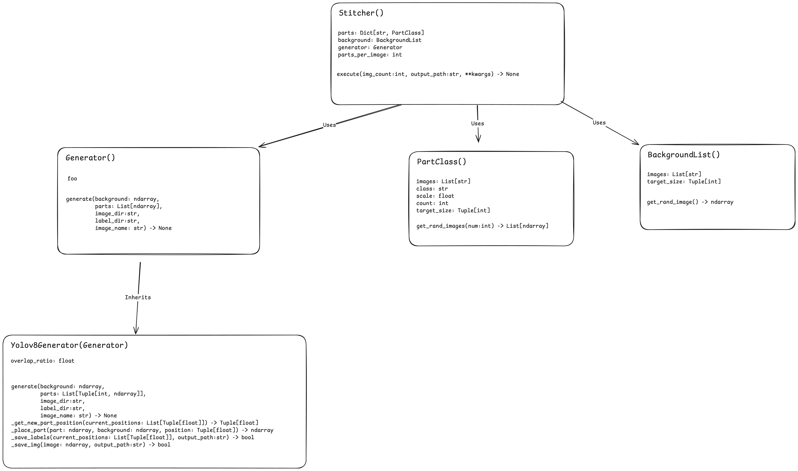

# SnapStitch

An open-source Python library for generating synthetic datasets for computer vision tasks. SnapStitch aims to simplify the process of creating realistic synthetic images to help improve computer vision model training.


## Features

Current Focus:
- Support YOLO model training by generating synthetic images by superimposing smaller objects onto a background and creating YOLO dataset

Future Plans:
- Supports various image transformations and augmentations to be applied on synthetic data.
- Support other computer vision tasks such as Segmentation and Pose Estimation
- Easy integration with existing computer vision pipelines.

## Current Status

This library is currently under development. Key features and functionalities are being implemented step-by-step. Below is the planned architecture and the class diagram representing the intended design.

### Class Diagram



*Note: The above class diagram illustrates the core components and their relationships within the library. It is a work in progress and will evolve as development continues.*

## Getting Started

### Prerequisites

```bash
pdm install
```

### Usage

The library is envisioned to be used in this way.

```python
from snapstitch import Stitcher, PartsList, BackgroundList, YOLOv8Generator

# Initialise path to backgrounds
background = BackgroundList("path/to/your/background")

# Initialise all your classes
parts_resistor = PartsList("path/to/your/images1", "resistor")
parts_capacitor = PartsList("path/to/your/images2", "capacitor")
parts_processor = PartsList("path/to/your/images3", "processor")

# Generate YOLOv8 data 
generator = YOLOv8Generator()

# Main class that handles generation
stitcher = Stitcher(background, [parts_resistor, parts_capacitor, parts_processor], generator)

# Generate as many times as needed
stitcher.execute(200, "path/to/your/output")
stitcher.execute(100, "path/to/your/output2")
stitcher.execute(500, "path/to/your/output")

```

## Contributing

Contributions are welcome! If you'd like to contribute to SnapStitch, please follow these steps:

1. Fork the repository.
2. Create a new branch (`git checkout -b feature-branch`).
3. Make your changes and commit them (`git commit -m 'Add new feature'`).
4. Push to the branch (`git push origin feature-branch`).
5. Open a pull request.

Please make sure to update the documentation and tests as needed.

## License

This project is licensed under the MIT License - see the [LICENSE](LICENSE) file for details.

## Acknowledgments

- Inspiration and guidance from the open-source community.
- Tools and libraries that facilitate synthetic data generation.
